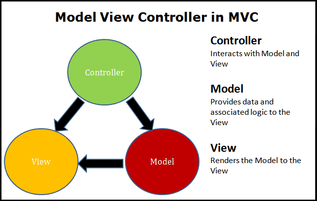

# Industry Level Rest API
Based on [Video](https://www.youtube.com/watch?v=PmDJIooZjBE&t=1739s&ab_channel=freeCodeCamp.org)
Follows the MVC framework

## Getting Started

### Requirements
- Visual Studio 2022 or VSCode with dotNet 6/7+ SDK
- API calling tool, this project uses [Rest Client](https://github.com/madskristensen/RestClientVS) but can also use good old Postman
    - [Collection of calls](https://github.com/ScTigerFang/Industry-Level-REST-API-using-.NET-6/tree/main/Rest_client_calls) 

### Docs
- API docs provided [Here](https://github.com/ScTigerFang/Industry-Level-REST-API-using-.NET-6/blob/main/Docs/Api.md)